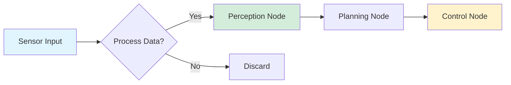
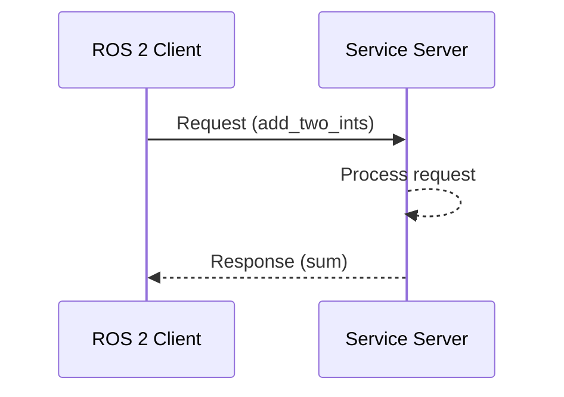
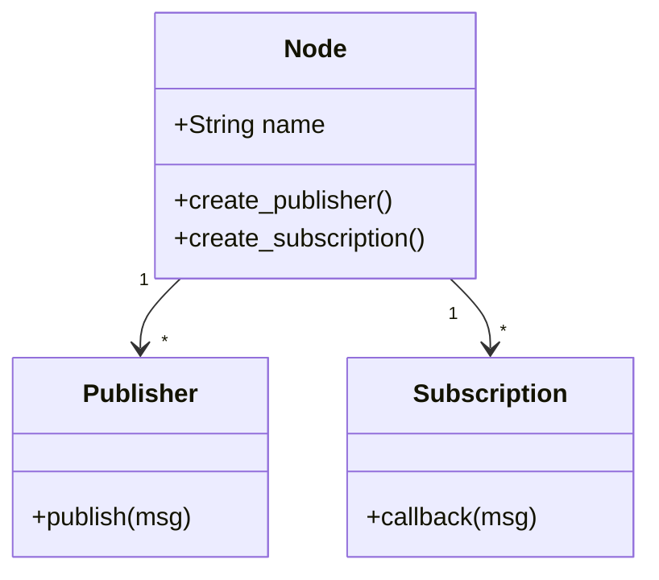
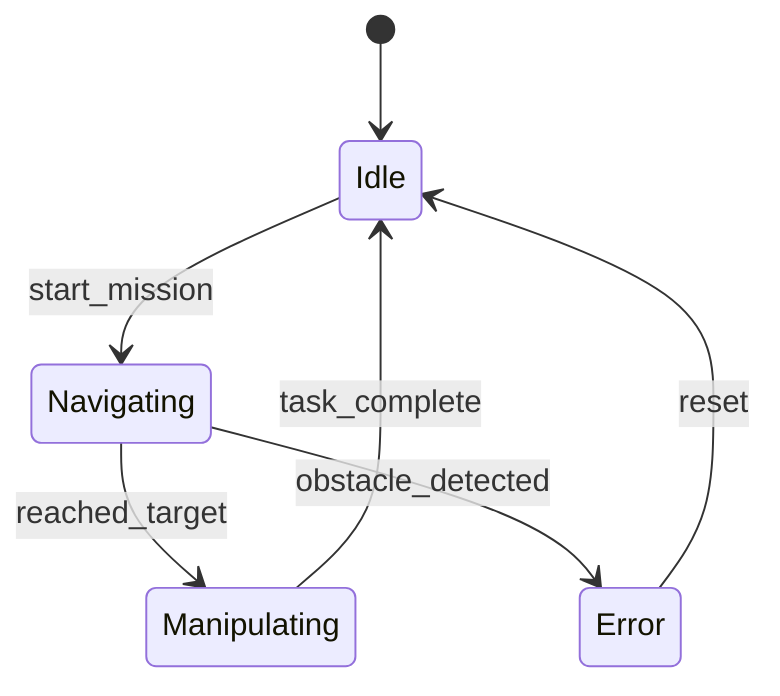
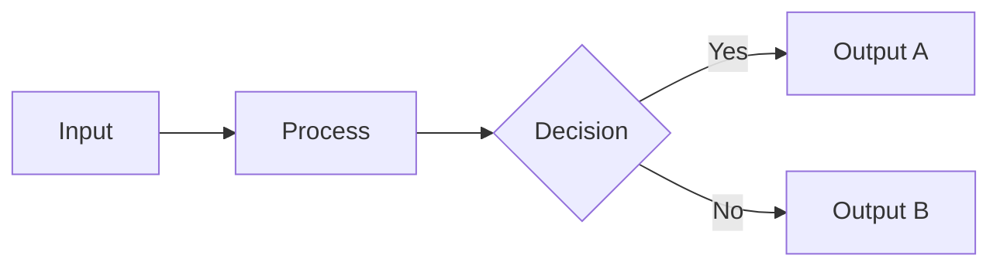
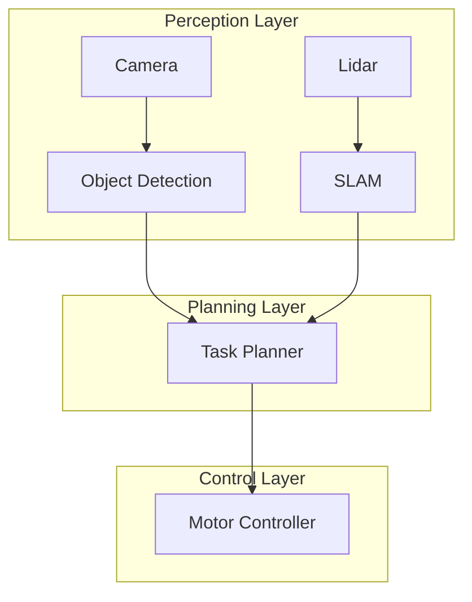
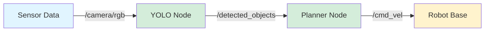
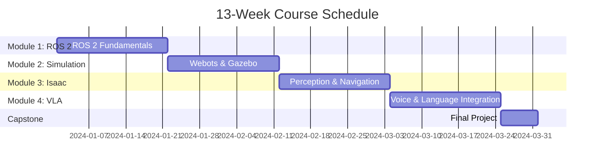
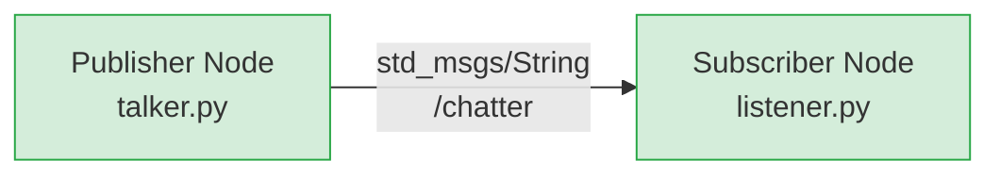
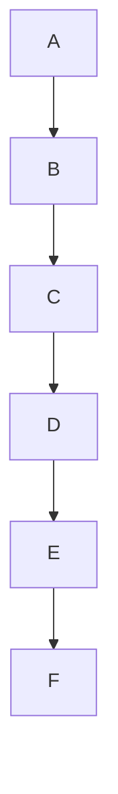

# Diagram Guidelines: Physical AI & Humanoid Robotics Book

> **Purpose**: Standards for creating clear, accessible, and maintainable diagrams
> **Applies to**: All diagrams in chapters, appendices, and documentation
> **Validation**: Required for accessibility (WCAG AA) and GitHub Pages deployment

---

## Table of Contents

1. [General Principles](#general-principles)
2. [Mermaid Diagrams (Preferred)](#mermaid-diagrams-preferred)
3. [Image Diagrams](#image-diagrams)
4. [Accessibility Requirements](#accessibility-requirements)
5. [File Size and Optimization](#file-size-and-optimization)
6. [Diagram Types and Templates](#diagram-types-and-templates)
7. [Validation Checklist](#validation-checklist)

---

## General Principles

### When to Use Diagrams

Use diagrams to:
- **Simplify complex architectures** (ROS 2 node graphs, VLA pipelines)
- **Show data flow** (sensor data ’ perception ’ planning ’ control)
- **Illustrate spatial relationships** (robot coordinate frames, workspace layouts)
- **Visualize algorithms** (flowcharts for perception pipelines, state machines)

**Do NOT** create diagrams for:
- Simple lists (use markdown bullets instead)
- Single-step processes
- Content that text explains more clearly

### Design Principles

1. **Clarity First**: Diagrams should be easier to understand than equivalent text
2. **Consistent Style**: Use the same shapes, colors, and layouts across the book
3. **Minimal Text**: Keep labels short; put detailed explanations in captions
4. **Logical Flow**: Left-to-right or top-to-bottom for processes
5. **Color with Purpose**: Use color to convey meaning, not decoration

---

## Mermaid Diagrams (Preferred)

**Why Mermaid?**
-  Version-controlled (text-based, in markdown)
-  Renders natively in Docusaurus
-  Easy to update and maintain
-  Consistent styling
-  No file size concerns

### Supported Mermaid Diagram Types

| Type | Use Case | Example |
|------|----------|---------|
| **Flowchart** | Algorithms, decision trees | Perception pipeline steps |
| **Sequence** | Inter-process communication | ROS 2 service call flow |
| **Class** | Software architecture | Node class hierarchies |
| **State** | Behavior diagrams | Robot operational states |
| **Graph** | Data/control flow | VLA system architecture |
| **Gantt** | Project timelines | 13-week course schedule |

### Mermaid Syntax Standards

#### Flowchart Example
````markdown


**Alt Text**: Flowchart showing sensor data flowing through perception, planning, and control nodes, with a decision point to process or discard data.

**Caption**: Figure X.Y: ROS 2 perception-to-control pipeline
````

**Styling Guidelines**:
- Use light fills for light mode compatibility (avoid dark colors)
- Color scheme:
  - Input/Output: `#e1f5ff` (light blue)
  - Processing: `#d4edda` (light green)
  - Decision: `#fff3cd` (light yellow)
  - Error/Alert: `#f8d7da` (light red)

#### Sequence Diagram Example
````markdown


**Alt Text**: Sequence diagram showing ROS 2 client sending request to service server and receiving response.

**Caption**: Figure X.Y: ROS 2 service call interaction
````

#### Class Diagram Example
````markdown


**Alt Text**: Class diagram showing ROS 2 Node class with relationships to Publisher and Subscription classes.

**Caption**: Figure X.Y: ROS 2 Node class structure
````

#### State Diagram Example
````markdown


**Alt Text**: State diagram showing robot transitions between Idle, Navigating, Manipulating, and Error states.

**Caption**: Figure X.Y: Humanoid robot operational states
````

### Mermaid Best Practices

1. **Keep it Simple**: Max 10-12 nodes per diagram
2. **Use Descriptive Labels**: Avoid abbreviations unless defined
3. **Add Direction**: Use `LR` (left-right) or `TB` (top-bottom) explicitly
4. **Test Rendering**: Preview in Docusaurus before committing
5. **Version Comments**: Add `%% Updated: YYYY-MM-DD` at top of complex diagrams

---

## Image Diagrams

Use images when:
- Showing screenshots of GUIs, simulations, or real robots
- Complex 3D visualizations not possible in Mermaid
- Annotated photos (hardware setup, component identification)

### Supported Formats

| Format | Use Case | Max File Size |
|--------|----------|--------------|
| **PNG** | Screenshots, diagrams with transparency | 500 KB |
| **JPG** | Photos, complex renders | 300 KB |
| **SVG** | Vector graphics (preferred for diagrams) | 100 KB |
| **WebP** | Modern format for photos (if browser support OK) | 250 KB |

**Avoid**: GIF (except for animations), BMP, TIFF

### File Organization

Place images in:
```
book/static/img/[module]/[chapter]/[diagram-name].[ext]
```

Example:
```
book/static/img/ros2/fundamentals/publisher-subscriber-architecture.svg
```

### Naming Convention

Use lowercase with hyphens:
-  `ros2-node-graph.png`
-  `isaac-sim-humanoid-setup.jpg`
- L `ROS2_Diagram_Final_v3.PNG`
- L `Screenshot 2023-11-15.png`

### Creating Image Diagrams

**Recommended Tools**:
- **Draw.io / diagrams.net** (free, export to SVG)
- **Excalidraw** (hand-drawn style, export to SVG)
- **Inkscape** (vector graphics)
- **PowerPoint** ’ Export as SVG

**Style Guide for Images**:
- Font: Sans-serif (Arial, Roboto), min 14pt
- Line width: 2-3px for clarity
- Colors: Same palette as Mermaid diagrams
- White or transparent background
- Consistent icon/shape usage

---

## Accessibility Requirements

### Alt Text (REQUIRED)

Every diagram MUST have alt text describing:
1. **Type of diagram**: "Flowchart showing...", "Sequence diagram of..."
2. **Main components**: "...perception node receiving sensor data..."
3. **Key relationships**: "...which then sends processed data to planning node"

**Bad Alt Text**:
- "Diagram" (too vague)
- "ROS 2 architecture" (not descriptive)
- "" (empty - NEVER DO THIS)

**Good Alt Text**:
```markdown
**Alt Text**: Flowchart showing ROS 2 data flow from camera sensor through perception node (YOLO object detection) to planning node (path planning) and control node (motor commands), with a feedback loop from odometry back to perception.
```

### WCAG AA Compliance

- **Color Contrast**: Minimum 4.5:1 for text on backgrounds
- **Text Size**: Minimum 14pt font in images
- **No Color-Only Information**: Use shapes/patterns in addition to color
- **Captions**: Every diagram needs a numbered caption

**Example**:
```markdown


**Alt Text**: Flowchart with input leading to process, then a decision diamond splitting into two outputs based on yes/no condition.

**Caption**: Figure 2.3: Generic decision flow
```

---

## File Size and Optimization

**GitHub Pages Limit**: 1 GB total repository size

### Optimization Guidelines

#### PNG/JPG Optimization
Use tools to compress images:
```bash
# Install optimization tools
npm install -g imagemin-cli

# Optimize PNG files
imagemin input.png --plugin=pngquant > output.png

# Optimize JPG files
imagemin input.jpg --plugin=mozjpeg > output.jpg
```

#### SVG Optimization
```bash
# Install SVGO
npm install -g svgo

# Optimize SVG
svgo input.svg -o output.svg
```

### Size Targets
- **Mermaid diagrams**: No file size concern (text-based)
- **Screenshots**: < 300 KB (compress to 80% quality if needed)
- **Vector diagrams**: < 100 KB
- **Photos**: < 200 KB (resize to max 1200px width)

### Resolution Guidelines
- **Web display**: 72-96 DPI
- **Max width**: 1200px (Docusaurus content width ~800px)
- **Retina displays**: 2x resolution OK if file size permits

---

## Diagram Types and Templates

### 1. System Architecture Diagrams

**Purpose**: Show high-level component relationships

**Template**:
````markdown


**Alt Text**: System architecture with three layers: Perception (camera/lidar sensors), Planning (task planner), and Control (motor controller), showing data flow from sensors to control.

**Caption**: Figure X.Y: Humanoid robot software architecture
````

### 2. Data Flow Diagrams

**Purpose**: Show how data moves through the system

**Template**:
````markdown


**Alt Text**: Data flow diagram showing sensor data published on /camera/rgb topic to YOLO detection node, which publishes detected objects to planner, which sends velocity commands to robot base.

**Caption**: Figure X.Y: Perception-to-control data flow
````

### 3. State Machine Diagrams

**Purpose**: Robot behavior and mode transitions

**Template**: See State Diagram Example above

### 4. Sequence Diagrams

**Purpose**: Time-ordered interactions between components

**Template**: See Sequence Diagram Example above

### 5. Timeline/Schedule Diagrams

**Purpose**: Course planning, project milestones

**Template**:
````markdown


**Alt Text**: Gantt chart showing 13-week schedule with four modules (ROS 2, Simulation, Isaac, VLA) each taking 3 weeks, followed by 1-week capstone project.

**Caption**: Figure X.Y: Course timeline breakdown
````

---

## Validation Checklist

Before adding a diagram to the book, verify:

### For All Diagrams
- [ ] Diagram adds value (doesn't duplicate text)
- [ ] Alt text is descriptive (min 20 characters)
- [ ] Figure number and caption present
- [ ] Referenced in chapter text ("see Figure X.Y")
- [ ] Consistent with other diagrams in style

### For Mermaid Diagrams
- [ ] Syntax validates (preview in Docusaurus)
- [ ] Max 12 nodes/components
- [ ] Direction specified (`LR` or `TB`)
- [ ] Colors use book palette
- [ ] Labels are concise

### For Image Diagrams
- [ ] File size < 500 KB
- [ ] Proper naming convention (lowercase-with-hyphens)
- [ ] Stored in correct directory (`book/static/img/[module]/`)
- [ ] Format is appropriate (PNG for screenshots, SVG for diagrams)
- [ ] Resolution is optimized (not excessive)

### Accessibility
- [ ] Alt text describes diagram completely
- [ ] Text in image is min 14pt
- [ ] Color contrast meets WCAG AA (4.5:1)
- [ ] Information not conveyed by color alone

---

## Common Mistakes to Avoid

### L DON'T
- Use diagrams for simple lists (use markdown instead)
- Include code in diagrams (put in code blocks)
- Create overly complex diagrams (>15 nodes)
- Use dark backgrounds (hard to see in light mode)
- Forget alt text
- Use proprietary tool formats (like .vsd, .sketch)

###  DO
- Keep diagrams focused on one concept
- Use consistent colors and shapes
- Test rendering in both light and dark modes
- Provide captions explaining what the diagram shows
- Use Mermaid whenever possible
- Optimize image file sizes

---

## Examples from Book

### Good Example: ROS 2 Publisher-Subscriber

````markdown


**Alt Text**: Graph showing ROS 2 publisher node (talker.py) sending String messages on /chatter topic to subscriber node (listener.py).

**Caption**: Figure 1.3: Basic ROS 2 publisher-subscriber pattern
````

**Why this is good**:
- Clear data flow (left to right)
- Shows message type and topic name
- Consistent node styling
- Complete alt text
- Referenced in text

### Bad Example

````markdown

````

**Why this is bad**:
- No labels (what are A-F?)
- No alt text
- No caption
- Too linear (doesn't need a diagram)
- Not referenced in text

---

## Tools and Resources

### Mermaid Documentation
- [Official Mermaid Docs](https://mermaid.js.org/)
- [Mermaid Live Editor](https://mermaid.live/)
- [Docusaurus Mermaid Plugin](https://docusaurus.io/docs/markdown-features/diagrams)

### Image Creation Tools
- [Draw.io](https://app.diagrams.net/) - Free diagramming tool
- [Excalidraw](https://excalidraw.com/) - Hand-drawn style diagrams
- [Inkscape](https://inkscape.org/) - Vector graphics editor

### Accessibility Tools
- [WebAIM Contrast Checker](https://webaim.org/resources/contrastchecker/)
- [WAVE Browser Extension](https://wave.webaim.org/extension/)

### Image Optimization
- [TinyPNG](https://tinypng.com/) - PNG/JPG compression
- [SVGOMG](https://jakearchibald.github.io/svgomg/) - SVG optimization
- [Squoosh](https://squoosh.app/) - Image compression

---

## Diagram Review Process

1. **Author creates diagram** following these guidelines
2. **Run validation script**:
   ```bash
   npm run validate-diagrams
   ```
   (Checks for missing alt text, file sizes)
3. **Preview in Docusaurus**:
   ```bash
   npm start
   ```
4. **Peer review**: Another contributor checks accessibility and clarity
5. **Commit**: Include diagram in PR with descriptive commit message

---

## Version History

- **v1.0.0** (2025-12-07): Initial diagram guidelines
  - Mermaid syntax standards
  - Accessibility requirements
  - File size optimization rules

---

## Questions?

If these guidelines don't cover your use case:
1. Check existing diagrams in the book for examples
2. Refer to [Docusaurus Diagram Documentation](https://docusaurus.io/docs/markdown-features/diagrams)
3. Open an issue on GitHub for clarification
