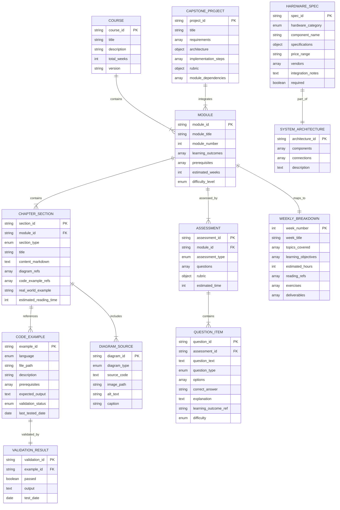

# Data Model: Physical AI & Humanoid Robotics Book

**Feature**: Physical AI & Humanoid Robotics Book
**Date**: 2025-12-07
**Status**: Complete

This document defines the structured content entities and their relationships for the Physical AI book.

---

## Entity Relationship Diagram



---

## Entity Specifications

### 1. Course

**Purpose**: Root entity representing the entire educational offering.

```yaml
Entity: Course
Fields:
  course_id: string (PK)
    - Value: "physical-ai-humanoid-robotics-v1"
    - Immutable identifier

  title: string
    - Value: "Physical AI & Humanoid Robotics"
    - Display title

  description: text
    - Summary of course content (2-3 paragraphs)
    - Appears on homepage

  total_weeks: integer
    - Value: 13
    - Fixed curriculum duration

  version: string
    - Value: "1.0.0"
    - Semantic versioning for content updates

  authors: array[string]
    - Content creators/contributors

  last_updated: date
    - Content revision date

Relationships:
  - contains 4+ Modules (ROS 2, Simulation, Isaac, VLA)
  - defines 13 WeeklyBreakdowns
  - culminates in 1 CapstoneProject

Validation Rules:
  - total_weeks must equal 13 (per spec)
  - Must contain at least 4 modules (per spec SC-002)
  - last_updated must be current when published
```

---

### 2. Module (CourseModule)

**Purpose**: Major topical unit (e.g., ROS 2 Fundamentals, NVIDIA Isaac).

```yaml
Entity: Module
Fields:
  module_id: string (PK)
    - Examples: "ros2", "simulation", "isaac", "vla"
    - URL-safe slug
    - Unique constraint

  module_title: string
    - Examples: "ROS 2 Fundamentals", "Vision-Language-Action Systems"
    - Display name

  module_number: integer
    - Range: 1-4 (for core modules)
    - Determines sequence

  learning_outcomes: array[string]
    - Minimum 3 items (validation rule)
    - Specific, measurable skills
    - Example: "Implement ROS 2 publisher/subscriber nodes in Python"

  prerequisites: array[string]
    - References to prior modules or external knowledge
    - Example: ["python-proficiency", "module:ros2"]

  estimated_weeks: integer
    - Range: 2-4 weeks per module
    - Sum across all modules must be ≤13

  difficulty_level: enum
    - Values: "beginner", "intermediate", "advanced"
    - Helps learners gauge readiness

Relationships:
  - contains multiple ChapterSections (7-part structure: overview, theory(n), lab, project, quiz)
  - maps to multiple WeeklyBreakdowns (e.g., Module 1 → Weeks 1-2)
  - includes multiple CodeExamples
  - assessed by Assessment entity

Validation Rules:
  - module_id must be unique
  - learning_outcomes.length >= 3
  - prerequisites must reference valid topics or existing modules
  - estimated_weeks: sum across all modules <= 13
  - Must contain sections of all required types (overview, lab, project, quiz)
```

**Example Instance**:
```json
{
  "module_id": "ros2",
  "module_title": "ROS 2 Fundamentals",
  "module_number": 1,
  "learning_outcomes": [
    "Explain ROS 2 architecture and communication patterns",
    "Implement publisher/subscriber nodes in Python",
    "Create and manipulate URDF robot descriptions",
    "Debug ROS 2 applications using command-line tools"
  ],
  "prerequisites": ["python-proficiency", "linux-cli-basics"],
  "estimated_weeks": 2,
  "difficulty_level": "intermediate"
}
```

---

### 3. ChapterSection

**Purpose**: Individual content page within a module (e.g., "ROS 2 Topics", "Gazebo World Building").

```yaml
Entity: ChapterSection
Fields:
  section_id: string (PK)
    - Examples: "ros2-nodes", "isaac-vslam", "vla-llm-planning"
    - URL slug for routing

  module_id: string (FK)
    - Parent module reference

  section_type: enum
    - Values: "overview", "theory", "code", "lab", "project", "quiz"
    - Determines template structure

  title: string
    - Display heading
    - Example: "Understanding ROS 2 Nodes"

  content_markdown: text (MDX)
    - Full page content
    - Supports embedded React components

  diagrams: array[diagram_id]
    - References to DiagramSource entities

  code_examples: array[example_id]
    - References to CodeExample entities

  real_world_example: string
    - 2-3 sentence industry application
    - Required for theory sections (validation rule)

  estimated_reading_time: integer
    - Minutes to complete (reading + exercises)

Relationships:
  - belongs to one Module
  - references multiple CodeExamples
  - includes multiple DiagramSources

Validation Rules:
  - Every "theory" section_type must include:
    - At least 1 diagram (diagrams.length >= 1)
    - At least 1 code example (code_examples.length >= 1)
    - 1 real_world_example (non-empty string)
    - (Per spec requirement: "every concept includes one diagram, one code block, one real-world example")

  - section_type sequence within module must follow pattern:
    - 1 "overview" (first)
    - 1+ "theory" sections
    - 1 "lab"
    - 1 "project"
    - 1 "quiz" (last)

  - content_markdown must pass markdownlint validation

  - All diagram_id and example_id references must exist
```

**Example Instance**:
```json
{
  "section_id": "ros2-topics",
  "module_id": "ros2",
  "section_type": "theory",
  "title": "ROS 2 Topics: Publish-Subscribe Communication",
  "content_markdown": "# ROS 2 Topics...\n\n[Full MDX content]",
  "diagrams": ["diagram-ros2-pubsub-flow"],
  "code_examples": ["ros2-publisher-basic", "ros2-subscriber-basic"],
  "real_world_example": "Autonomous vehicles use ROS 2 topics to stream sensor data from LiDAR, cameras, and radar to perception nodes at 10-30Hz, enabling real-time object detection (e.g., Waymo's self-driving stack).",
  "estimated_reading_time": 25
}
```

---

### 4. WeeklyBreakdown

**Purpose**: Study schedule mapping topics to 13-week curriculum.

```yaml
Entity: WeeklyBreakdown
Fields:
  week_number: integer (PK)
    - Range: 1-13
    - Unique constraint

  week_title: string
    - Example: "Week 3: Simulation Environments & Sensor Modeling"

  topics_covered: array[string]
    - High-level topics for the week
    - Example: ["Gazebo world building", "Camera sensor simulation", "LiDAR setup"]

  learning_objectives: array[string]
    - Specific goals for the week
    - Aligned with module learning_outcomes

  estimated_hours: integer
    - Range: 8-12 hours (per spec assumption)
    - Helps learners plan time

  readings: array[section_id]
    - References to ChapterSections to complete

  exercises: array[string]
    - Hands-on activities (lab assignments)

  deliverables: array[string]
    - What learners should submit/demonstrate
    - Example: ["Working Gazebo simulation with robot", "Screenshot of sensor visualization"]

Relationships:
  - maps to one or more Modules
  - references multiple ChapterSections

Validation Rules:
  - week_number must be unique (1-13)
  - estimated_hours must be 8-12 (per spec)
  - All section_id in readings must reference existing ChapterSections
  - deliverables.length >= 1 (every week has output)
```

**Example Instance**:
```json
{
  "week_number": 3,
  "week_title": "Week 3: Simulation Environments & Sensor Modeling",
  "topics_covered": [
    "Gazebo Classic vs Gazebo Sim architecture",
    "Building custom worlds with SDF",
    "Simulating RGB and depth cameras",
    "LiDAR point cloud visualization"
  ],
  "learning_objectives": [
    "Set up Gazebo simulation environment",
    "Create a custom world with obstacles",
    "Attach and configure simulated sensors on robot URDF"
  ],
  "estimated_hours": 12,
  "readings": [
    "simulation-overview",
    "gazebo-setup",
    "gazebo-worlds",
    "sensor-simulation"
  ],
  "exercises": [
    "Lab 2.1: Build a warehouse environment in Gazebo",
    "Lab 2.2: Add RGB camera to TurtleBot3 and visualize in RViz"
  ],
  "deliverables": [
    "Gazebo world file (.world) with 5+ obstacles",
    "Screenshot of camera feed in RViz",
    "LiDAR point cloud recording (.bag file)"
  ]
}
```

---

### 5. CodeExample

**Purpose**: Validated, runnable code snippet demonstrating a concept.

```yaml
Entity: CodeExample
Fields:
  example_id: string (PK)
    - Examples: "ros2-publisher-basic", "isaac-object-detection"
    - Unique, descriptive slug

  language: enum
    - Values: "python", "cpp", "bash", "yaml", "xml" (URDF/SDF)

  file_path: string
    - Relative path in code-examples/ directory
    - Example: "code-examples/ros2/publisher_basic.py"

  description: string
    - One-sentence summary
    - Example: "Basic ROS 2 publisher node sending string messages to /chatter topic"

  prerequisites: array[string]
    - Required setup steps
    - Example: ["ROS 2 Humble installed", "colcon build workspace"]

  expected_output: text
    - What learners should see when running
    - Example: "[INFO] Publishing: 'Hello World: 0'"

  validation_status: enum
    - Values: "untested", "passing", "failing"
    - Automated by scripts/validate-code-examples.py

  last_tested_date: date
    - When validation script last ran
    - Must be recent for "passing" status

Relationships:
  - referenced by multiple ChapterSections
  - validated by ValidationResult (1:1)

Validation Rules:
  - validation_status must be "passing" before book deployment (CI check)
  - file_path must exist and be executable/runnable
  - prerequisites array must be non-empty (setup instructions required)
  - last_tested_date must be within 30 days for "passing" status
```

**Example Instance**:
```json
{
  "example_id": "ros2-publisher-basic",
  "language": "python",
  "file_path": "code-examples/ros2/publisher_basic.py",
  "description": "Minimal ROS 2 publisher node sending string messages to /chatter topic at 1Hz",
  "prerequisites": [
    "ROS 2 Humble installed (sudo apt install ros-humble-desktop)",
    "Source ROS 2 setup: source /opt/ros/humble/setup.bash",
    "Create workspace: mkdir -p ~/ros2_ws/src && cd ~/ros2_ws"
  ],
  "expected_output": "[INFO] [minimal_publisher]: Publishing: 'Hello World: 0'\n[INFO] [minimal_publisher]: Publishing: 'Hello World: 1'",
  "validation_status": "passing",
  "last_tested_date": "2025-12-07"
}
```

---

### 6. Assessment

**Purpose**: Quiz, exercise, or project for evaluating module mastery.

```yaml
Entity: Assessment
Fields:
  assessment_id: string (PK)
    - Example: "quiz-ros2-fundamentals"

  module_id: string (FK)
    - Parent module (or "capstone" for final project)

  assessment_type: enum
    - Values: "quiz", "exercise", "project"

  questions: array[QuestionItem]
    - For quizzes: multiple-choice, true/false, coding challenges
    - Minimum 5 questions per module (validation rule, per SC-010)

  rubric: object
    - For projects: grading criteria with point values
    - Example: {"functionality": 40, "code_quality": 30, "documentation": 30}

  estimated_time: integer
    - Minutes to complete

Relationships:
  - belongs to one Module (or Capstone)
  - contains multiple QuestionItems
  - aligns with learning_outcomes of module

Validation Rules:
  - Each module must have at least 5 assessment questions (per SC-010)
  - For type="quiz": questions.length >= 5
  - For type="project": rubric must be non-empty object
  - Questions must map to specific learning_outcomes (validation via question.learning_outcome_ref)
  - Project rubrics must have clear success criteria (rubric values sum to 100)
```

**Example Instance**:
```json
{
  "assessment_id": "quiz-ros2-fundamentals",
  "module_id": "ros2",
  "assessment_type": "quiz",
  "questions": [
    {"question_id": "q-ros2-001", "...": "..."},
    {"question_id": "q-ros2-002", "...": "..."}
  ],
  "rubric": null,
  "estimated_time": 20
}
```

---

### 7. QuestionItem

**Purpose**: Individual assessment question with answer and explanation.

```yaml
Entity: QuestionItem
Fields:
  question_id: string (PK)
    - Example: "q-ros2-topics-01"

  assessment_id: string (FK)
    - Parent assessment

  question_text: text
    - The question itself
    - Example: "Which ROS 2 communication pattern is best for requesting one-time data from another node?"

  question_type: enum
    - Values: "multiple_choice", "true_false", "coding_exercise", "short_answer"

  options: array[string]
    - For multiple_choice: array of answer choices
    - Example: ["Topics", "Services", "Actions", "Parameters"]

  correct_answer: string or integer
    - For MC: index (0-based) or answer text
    - For TF: "true" or "false"
    - For coding: reference to expected code/output

  explanation: text
    - Why this answer is correct (2-3 sentences)
    - Reinforces learning

  learning_outcome_ref: string
    - Maps to module.learning_outcomes[i]
    - Ensures alignment

  difficulty: enum
    - Values: "beginner", "intermediate", "advanced"

Validation Rules:
  - For question_type="multiple_choice": options.length >= 2 (at least 2 choices)
  - explanation must be non-empty (learning reinforcement required)
  - learning_outcome_ref must match an existing learning outcome in parent module
```

**Example Instance**:
```json
{
  "question_id": "q-ros2-topics-01",
  "assessment_id": "quiz-ros2-fundamentals",
  "question_text": "Which ROS 2 communication pattern is best for requesting one-time data from another node?",
  "question_type": "multiple_choice",
  "options": ["Topics", "Services", "Actions", "Parameters"],
  "correct_answer": 1,
  "explanation": "Services use a request-response pattern ideal for one-time queries (e.g., 'get current pose'). Topics are for continuous streaming, Actions for long-running tasks with feedback, and Parameters for configuration.",
  "learning_outcome_ref": "Explain ROS 2 architecture and communication patterns",
  "difficulty": "beginner"
}
```

---

### 8. DiagramSource

**Purpose**: Visual content (Mermaid diagrams, architecture images).

```yaml
Entity: DiagramSource
Fields:
  diagram_id: string (PK)
    - Example: "diagram-ros2-pubsub-flow"

  diagram_type: enum
    - Values: "mermaid", "image", "architecture"

  source_code: text
    - For mermaid: Mermaid syntax
    - For others: null

  image_path: string
    - For pre-rendered images: path in static/img/
    - Example: "static/img/system-architecture.png"

  alt_text: string
    - Accessibility description (required)
    - Example: "Diagram showing ROS 2 publisher node sending messages to subscriber node via /chatter topic"

  caption: string
    - Optional figure caption

Validation Rules:
  - alt_text is required (WCAG AA compliance, per constitution)
  - For diagram_type="mermaid": source_code must be valid Mermaid syntax (validated at build)
  - For diagram_type="image": image_path must exist
  - Mermaid diagrams must render without errors (CI validation)
```

**Example Instance**:
```json
{
  "diagram_id": "diagram-ros2-pubsub-flow",
  "diagram_type": "mermaid",
  "source_code": "graph LR\n  A[Publisher Node] -->|/chatter topic| B[Subscriber Node]",
  "image_path": null,
  "alt_text": "Flowchart showing publisher node sending messages to subscriber node via /chatter topic",
  "caption": "Figure 1.2: ROS 2 publish-subscribe communication pattern"
}
```

---

### 9. HardwareSpecification

**Purpose**: Hardware component details for physical robot deployment (optional sections).

```yaml
Entity: HardwareSpecification
Fields:
  spec_id: string (PK)
    - Example: "hw-jetson-orin-nano"

  hardware_category: enum
    - Values: "workstation", "edge_ai_kit", "robot_platform", "cloud"

  component_name: string
    - Example: "NVIDIA Jetson Orin Nano 8GB Developer Kit"

  specifications: object
    - Detailed specs as key-value pairs
    - Example: {"ram": "8GB", "gpu": "1024-core NVIDIA Ampere", "cpu": "6-core Arm Cortex-A78AE"}

  price_range: string
    - Example: "$250-$300 (as of Dec 2025)"
    - Includes date for context

  vendors: array[string]
    - Where to purchase
    - Example: ["NVIDIA Store", "Amazon", "Seeed Studio"]

  integration_notes: text
    - How to connect/configure with course stack
    - Example: "Runs ROS 2 Humble natively on Ubuntu 20.04/22.04. Install via..."

  required: boolean
    - true for workstation specs (Tier 0)
    - false for optional hardware (Tiers 1-3)

Relationships:
  - part of SystemArchitecture (overall hardware setup)
  - referenced in setup instructions (ChapterSections)

Validation Rules:
  - workstation category specs must meet minimum requirements (RTX GPU or equivalent, 16GB RAM)
  - price_range must include "as of [date]" for currency context
  - required=true for workstation, false for all others (per hardware tiers in research.md)
```

**Example Instance**:
```json
{
  "spec_id": "hw-jetson-orin-nano",
  "hardware_category": "edge_ai_kit",
  "component_name": "NVIDIA Jetson Orin Nano 8GB Developer Kit",
  "specifications": {
    "ram": "8GB LPDDR5",
    "gpu": "1024-core NVIDIA Ampere",
    "cpu": "6-core Arm Cortex-A78AE v8.2",
    "storage": "microSD (64GB+ recommended)",
    "power": "7-15W",
    "io": "USB 3.2, Gigabit Ethernet, GPIO, I2C, SPI"
  },
  "price_range": "$250-$300 (as of December 2025)",
  "vendors": ["NVIDIA Developer Store", "Amazon", "Seeed Studio"],
  "integration_notes": "Runs ROS 2 Humble natively on Ubuntu 22.04. Supports RealSense D435i via USB 3.0. Deploy trained ONNX models with TensorRT for real-time inference.",
  "required": false
}
```

---

### 10. CapstoneProject

**Purpose**: Final integrative project synthesizing all modules.

```yaml
Entity: CapstoneProject
Fields:
  project_id: string (PK)
    - Value: "capstone-voice-controlled-humanoid"

  title: string
    - Value: "Voice-Controlled Humanoid Robot in Simulation"

  requirements: array[string]
    - Clear specifications
    - Example: ["Accept voice commands via Whisper", "Navigate to target location", "Identify and grasp objects"]

  architecture: object
    - System design with components
    - Example: {"voice_input": "Whisper ASR", "planning": "GPT-4 LLM", "control": "ROS 2 MoveIt"}

  implementation_steps: array[object]
    - Step-by-step guide
    - Example: [{"step": 1, "title": "Set up Gazebo humanoid model", "tasks": [...]}]

  rubric: object
    - Grading criteria
    - Example: {"voice_processing": 20, "navigation": 25, "manipulation": 30, "integration": 25}

  module_dependencies: array[module_id]
    - Which modules are required
    - Example: ["ros2", "simulation", "vla"]

Validation Rules:
  - requirements.length >= 5 (comprehensive scope)
  - rubric values must sum to 100 (percentage grading)
  - module_dependencies must reference existing modules
  - All implementation_steps must be actionable (have clear tasks)
```

**Example Instance**:
```json
{
  "project_id": "capstone-voice-controlled-humanoid",
  "title": "Voice-Controlled Humanoid Robot in Simulation",
  "requirements": [
    "Accept natural language voice commands using Whisper ASR",
    "Use LLM to plan action sequence from command",
    "Navigate to target location in Gazebo world",
    "Identify objects using Isaac or OpenCV perception",
    "Grasp and manipulate target object with MoveIt"
  ],
  "architecture": {
    "voice_input": "Whisper (openai-whisper)",
    "nlp_planning": "GPT-4 or Llama 2",
    "navigation": "Nav2 stack (ROS 2)",
    "perception": "YOLO v8 object detection",
    "manipulation": "MoveIt 2",
    "simulation": "Gazebo + TIAGo humanoid URDF"
  },
  "implementation_steps": [
    {
      "step": 1,
      "title": "Set up Gazebo environment with humanoid",
      "tasks": ["Install TIAGo robot packages", "Create test world with objects", "Verify robot spawns correctly"]
    }
  ],
  "rubric": {
    "voice_command_processing": 20,
    "task_planning_accuracy": 20,
    "navigation_success": 25,
    "object_manipulation": 30,
    "code_quality": 5
  },
  "module_dependencies": ["ros2", "simulation", "vla"]
}
```

---

## Validation Schema Summary

### Cross-Entity Validation Rules

1. **Referential Integrity**:
   - All foreign keys (module_id, section_id, example_id, etc.) must reference existing entities
   - Orphaned entities not allowed

2. **Content Coverage** (per SC-002):
   - Each of 4 core modules must have:
     - 1 overview section
     - 3+ theory sections
     - 1 lab section
     - 1 project section
     - 1 quiz section
   - 100% section coverage required

3. **Assessment Requirements** (per SC-010):
   - Each module must have ≥5 assessment questions
   - Questions must map to learning outcomes

4. **Code Example Requirements** (per SC-008):
   - Every code example must have:
     - Non-empty prerequisites
     - Expected output description
     - validation_status = "passing" (before deployment)

5. **Weekly Breakdown Balance** (per SC-003):
   - 13 weeks total
   - Each week: 8-12 estimated_hours
   - All modules covered across weeks

6. **Diagram Requirements**:
   - Every theory section must have ≥1 diagram
   - All diagrams must have alt_text (accessibility)

---

## Implementation Notes

### Database/Storage Strategy
Since this is a static site (Docusaurus), entities are represented as:
- **Markdown files**: ChapterSections (docs/*.md with YAML frontmatter)
- **JSON files**: Assessments, CodeExamples metadata (stored in data/ directory)
- **TypeScript/JavaScript**: Data model validation in build scripts
- **Git**: Version control and history tracking

### Validation Approach
```javascript
// scripts/validate-data-model.js
const validateModule = (module) => {
  assert(module.learning_outcomes.length >= 3, "Module must have ≥3 learning outcomes");
  assert(module.sections.filter(s => s.section_type === 'overview').length === 1, "Module must have 1 overview");
  // ... more validation rules
};
```

### Query Patterns (for build scripts)
```javascript
// Get all code examples for a module
const getModuleCodeExamples = (moduleId) => {
  return sections
    .filter(s => s.module_id === moduleId)
    .flatMap(s => s.code_examples);
};

// Get weekly breakdown for a specific week
const getWeekTopics = (weekNum) => {
  return weeklyBreakdowns.find(w => w.week_number === weekNum);
};
```

---

## Next Steps

1. **Create contracts/**: Template files based on these entities
2. **Implement validation scripts**: Enforce rules at build time
3. **Populate sample data**: Create 1-2 complete module instances to test structure
4. **Generate tasks.md**: Break down content creation per entity

**Status**: ✅ Data model complete and ready for contract generation.
