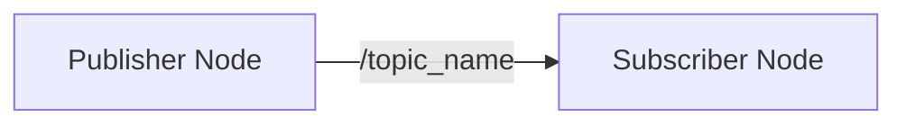

# Physical AI & Humanoid Robotics Book - Development Quickstart

**Target Users**: Content contributors, technical reviewers, and maintainers
**Last Updated**: 2025-12-07
**Version**: 1.0.0

---

## Overview

This guide helps you set up the development environment for the Physical AI & Humanoid Robotics book and understand the contribution workflow. The book is built with Docusaurus v3 and deployed automatically to GitHub Pages.

---

## Prerequisites

Before starting, ensure you have:

- **Node.js 18+** (for Docusaurus build)
- **Python 3.10+** (for code example validation)
- **Git** (for version control)
- **Text Editor/IDE** (VS Code recommended with Markdown extensions)

### Verification

```bash
# Check versions
node --version  # Should be v18.x or higher
python --version  # Should be 3.10.x or higher
git --version
```

---

## Quick Setup

### 1. Clone Repository

```bash
git clone <repository-url>
cd Physical-AI-Humanoid-Robotics
```

### 2. Install Docusaurus Dependencies

```bash
cd book
npm install
```

This installs Docusaurus, React, MDX processor, and all required plugins.

### 3. Install Validation Tools

```bash
# Return to repo root
cd ..

# Install Python dependencies for validation
pip install -r requirements.txt

# Dependencies include:
# - markdownlint-cli (markdown linting)
# - pytest (code example testing)
# - jsonschema (assessment validation)
```

### 4. Run Local Development Server

```bash
cd book
npm start
```

This launches a local development server at `http://localhost:3000` with hot-reload.

**Expected output**:
```
[INFO] Starting the development server...
[SUCCESS] Docusaurus website is running at: http://localhost:3000/
```

### 5. Verify Build

```bash
npm run build
```

This generates the production build in `book/build/`. Ensure it completes without errors.

---

## Project Structure

Based on the implementation plan (`specs/001-physical-ai-book/plan.md`), the repository is organized as:

```
Physical-AI-Humanoid-Robotics/
├── book/                           # Docusaurus site root
│   ├── docs/                       # Main content directory
│   │   ├── intro.md               # Introduction: Why Physical AI Matters
│   │   ├── prerequisites.md       # Prerequisites & learning outcomes
│   │   ├── weekly-breakdown.md    # 13-week curriculum overview
│   │   ├── module-ros2/           # Module 1: ROS 2 Fundamentals
│   │   │   ├── overview.md
│   │   │   ├── nodes.md
│   │   │   ├── topics-services.md
│   │   │   ├── urdf.md
│   │   │   ├── lab.md
│   │   │   ├── project.md
│   │   │   └── quiz.md
│   │   ├── module-simulation/     # Module 2: Gazebo & Unity
│   │   ├── module-isaac/          # Module 3: NVIDIA Isaac
│   │   ├── module-vla/            # Module 4: Vision-Language-Action
│   │   ├── capstone/              # Capstone Project
│   │   └── hardware/              # Hardware Requirements
│   ├── static/                    # Static assets
│   │   ├── img/                   # Images and diagrams
│   │   └── diagrams/              # Mermaid diagram sources
│   ├── src/                       # Custom React components
│   │   ├── components/
│   │   └── css/
│   ├── docusaurus.config.js       # Docusaurus configuration
│   ├── sidebars.js                # Navigation structure
│   └── package.json               # Node.js dependencies
│
├── code-examples/                 # Validated code samples
│   ├── ros2/                      # ROS 2 examples
│   ├── gazebo/                    # Gazebo examples
│   ├── unity/                     # Unity examples
│   ├── isaac/                     # Isaac examples
│   └── vla/                       # VLA examples
│
├── scripts/                       # Validation and build scripts
│   ├── validate-code-examples.py # Test all code examples
│   ├── check-links.js            # Validate internal/external links
│   └── lint-markdown.sh          # Markdown linting
│
├── tests/                        # Build and content tests
│   ├── build-test.js             # Verify Docusaurus builds
│   └── content-coverage.js       # Verify all sections present
│
├── specs/                        # Spec-Driven Development artifacts
│   └── 001-physical-ai-book/
│       ├── spec.md               # Feature specification
│       ├── plan.md               # Implementation plan (this workflow)
│       ├── research.md           # Architecture decisions
│       ├── data-model.md         # Content entity definitions
│       ├── contracts/            # Content templates
│       ├── quickstart.md         # This file
│       └── tasks.md              # Implementation tasks (generated by /sp.tasks)
│
├── .github/
│   └── workflows/
│       └── deploy.yml            # GitHub Actions deployment
│
├── README.md                     # Project overview
└── requirements.txt              # Python dependencies
```

---

## Content Creation Workflow

### Writing a New Chapter

Follow this process to add a new chapter/section:

#### Step 1: Choose Template

Use the chapter template from `specs/001-physical-ai-book/contracts/chapter-template.md`:

```bash
cp specs/001-physical-ai-book/contracts/chapter-template.md book/docs/[module]/[chapter-name].md
```

#### Step 2: Fill Content

Edit the new markdown file following the template structure:
- **Overview**: Learning outcomes, prerequisites, estimated time
- **Theory & Concepts**: Explanation, equations, real-world examples, diagrams, code
- **Hands-On Lab**: Step-by-step implementation
- **Module Project**: Requirements, deliverables, rubric
- **Quiz**: Minimum 5 questions with answers

**Required elements** (per `data-model.md` validation rules):
- Every theory section MUST have: 1 diagram, 1 code example, 1 real-world example
- Section order: Overview → Theory (1+) → Lab → Project → Quiz

#### Step 3: Add Code Examples

Create validated code examples in `code-examples/[module]/`:

```bash
# Copy template
cp specs/001-physical-ai-book/contracts/code-example-template.py code-examples/[module]/[example-name].py

# Fill in the template
# - Complete header metadata
# - Implement example code
# - Test locally to ensure it runs
```

#### Step 4: Reference Code in Chapter

In your chapter markdown:

```markdown
**Code Example**:
Reference: [`example-id`](../../code-examples/[module]/[filename].py)

[Include inline snippet or full code block]
```

#### Step 5: Validate Code

Run the validation script:

```bash
python scripts/validate-code-examples.py
```

This tests all code examples and updates `validation_status` to "passing" or "failing".

#### Step 6: Test Build

```bash
cd book
npm run build
```

Ensure no errors. Common issues:
- Broken internal links
- Invalid Mermaid diagram syntax
- Missing frontmatter in markdown

#### Step 7: Submit Pull Request

```bash
git checkout -b feature/[chapter-name]
git add book/docs/[module]/[chapter-name].md code-examples/[module]/
git commit -m "Add chapter: [Chapter Title]"
git push origin feature/[chapter-name]
```

Create PR with description referencing the spec.

---

### Adding Code Examples

For standalone code example contributions:

1. **Copy Template**:
```bash
cp specs/001-physical-ai-book/contracts/code-example-template.py code-examples/[module]/[name].py
```

2. **Fill Header Metadata**:
   - Example ID (unique slug)
   - Prerequisites (specific setup steps)
   - Expected output (what learners see)

3. **Implement & Test Locally**:
```bash
# Ensure prerequisites are met, then run:
python code-examples/[module]/[name].py
```

4. **Add to Validation Suite**:
   - The validation script auto-discovers examples in `code-examples/`
   - Ensure your example runs without errors

5. **Reference from Chapter**:
   - Update chapter markdown to reference your `example-id`

---

### Creating Diagrams

Two approaches for diagrams:

#### Option 1: Mermaid (Preferred)

Embed Mermaid syntax directly in markdown:

````markdown


**Alt Text**: Flowchart showing publisher-subscriber communication pattern
````

Mermaid renders automatically in Docusaurus. Validate syntax at [mermaid.live](https://mermaid.live).

#### Option 2: Static Images

For complex diagrams created externally:

1. Save image in `book/static/img/[module]/[diagram-name].png`
2. Reference in markdown:
```markdown

*Figure X.Y: Caption text*
```

**Accessibility requirement**: Always include alt text (per constitution).

---

## Validation Checklist

Before submitting content, verify:

### Markdown Linting

```bash
npm run lint:md
```

Checks:
- Proper heading hierarchy
- No trailing spaces
- Consistent list formatting

### Code Example Validation

```bash
python scripts/validate-code-examples.py
```

Ensures:
- All examples run without errors
- Validation status updated
- Prerequisites documented

### Link Checking

```bash
node scripts/check-links.js
```

Validates:
- Internal links point to existing pages
- External links are reachable (optional)

### Build Success

```bash
cd book
npm run build
```

Must complete with exit code 0.

### Content Coverage

```bash
node tests/content-coverage.js
```

Verifies:
- All modules have required sections (overview, lab, project, quiz)
- Minimum 5 assessment questions per module (SC-010)
- Every concept has diagram + code + example

---

## Deployment

### Automatic Deployment (Recommended)

GitHub Actions automatically deploys to GitHub Pages on push to `main`:

```yaml
# .github/workflows/deploy.yml
name: Deploy Docusaurus to GitHub Pages

on:
  push:
    branches: [main]

jobs:
  deploy:
    runs-on: ubuntu-latest
    steps:
      - uses: actions/checkout@v3
      - uses: actions/setup-node@v3
        with:
          node-version: 18
      - run: cd book && npm ci
      - run: cd book && npm run build
      - uses: peaceiris/actions-gh-pages@v3
        with:
          github_token: ${{ secrets.GITHUB_TOKEN }}
          publish_dir: ./book/build
```

**Expected behavior**:
1. Push to `main` triggers workflow
2. Build completes in ~2-3 minutes
3. Site deploys to `https://<username>.github.io/<repo-name>/`

### Manual Deployment

For local testing before deploying:

```bash
cd book

# Build static site
npm run build

# Serve locally
npm run serve
```

Visit `http://localhost:3000` to preview production build.

---

## Citation Style

Use IEEE/ACM format for robotics papers (standard in robotics field):

**Format**: `[Author(s), "Paper Title", Conference/Journal, Year]`

**Examples**:
- `[Siciliano et al., "Robotics: Modelling, Planning and Control", Springer, 2009]`
- `[Lynch & Park, "Modern Robotics", Cambridge University Press, 2017]`
- `[Koenig & Howard, "Design and Use Paradigms for Gazebo, An Open-Source Multi-Robot Simulator", IROS 2004]`

**In Markdown**:
```markdown
## References
- [1] Siciliano et al., "Robotics: Modelling, Planning and Control", Springer, 2009
- [2] Lynch & Park, "Modern Robotics", Cambridge University Press, 2017
```

---

## Development Tips

### Hot Reload Issues

If changes don't appear:
1. Stop dev server (Ctrl+C)
2. Clear cache: `rm -rf book/.docusaurus book/node_modules/.cache`
3. Restart: `npm start`

### Markdown Formatting

Use a Markdown linter extension in VS Code:
- **Extension**: `markdownlint` by David Anson
- Auto-fixes many formatting issues on save

### Mermaid Diagram Debugging

Test syntax before embedding:
1. Visit [mermaid.live](https://mermaid.live)
2. Paste diagram code
3. Verify rendering
4. Copy validated syntax to markdown

### Code Example Testing

For ROS 2 examples requiring full environment:
- Use Docker container with ROS 2 pre-installed
- Mount `code-examples/` directory
- Test in isolated environment

### Search Functionality

Docusaurus includes built-in search. To test:
1. Build production version: `npm run build`
2. Serve: `npm run serve`
3. Use search bar to find content

---

## Common Issues & Solutions

### Issue: "Module not found" during build

**Cause**: Missing dependency or incorrect import path
**Solution**:
```bash
cd book
npm install
# or
npm ci  # Clean install from package-lock.json
```

### Issue: Code examples fail validation

**Cause**: Missing dependencies or incorrect prerequisites
**Solution**:
- Check code example header for prerequisites
- Install missing ROS 2 packages or Python libraries
- Update expected output in code header

### Issue: Broken internal links

**Cause**: Referenced file doesn't exist or path is wrong
**Solution**:
- Verify file exists at referenced path
- Use relative paths: `../module/page.md` not `/module/page.md`
- Run link checker: `node scripts/check-links.js`

### Issue: Mermaid diagram doesn't render

**Cause**: Syntax error in Mermaid code
**Solution**:
- Validate at [mermaid.live](https://mermaid.live)
- Check for missing semicolons, quote matching
- Ensure code fence uses `mermaid` language tag

### Issue: GitHub Pages shows 404

**Cause**: Deployment configuration issue
**Solution**:
1. Check repository settings → Pages → Source is `gh-pages` branch
2. Verify `docusaurus.config.js` has correct `baseUrl` and `url`
3. Re-run deployment workflow

---

## Contributing Guidelines

### Branching Strategy

- `main`: Production-ready content (auto-deploys)
- `feature/[chapter-name]`: New content
- `fix/[issue]`: Bug fixes or corrections

### Commit Messages

Follow conventional commits:
- `feat: Add ROS 2 Topics chapter`
- `fix: Correct code example in Isaac perception`
- `docs: Update quickstart with Docker instructions`

### Pull Request Process

1. Create feature branch from `main`
2. Make changes following templates and validation rules
3. Run all validation checks (markdown lint, code validation, build)
4. Push and create PR
5. Address review feedback
6. Merge after approval (auto-deploys to GitHub Pages)

---

## Getting Help

### Documentation
- **Spec**: `specs/001-physical-ai-book/spec.md`
- **Plan**: `specs/001-physical-ai-book/plan.md`
- **Data Model**: `specs/001-physical-ai-book/data-model.md`
- **Research**: `specs/001-physical-ai-book/research.md`

### Templates
- **Chapter**: `specs/001-physical-ai-book/contracts/chapter-template.md`
- **Code Example**: `specs/001-physical-ai-book/contracts/code-example-template.py`
- **Assessment**: `specs/001-physical-ai-book/contracts/assessment-schema.json`

### External Resources
- [Docusaurus Documentation](https://docusaurus.io/docs)
- [Mermaid Documentation](https://mermaid.js.org/intro/)
- [ROS 2 Documentation](https://docs.ros.org/en/humble/)

### Contact
- **Issues**: GitHub repository issues
- **Discussions**: GitHub repository discussions
- **Email**: [Project maintainer email]

---

## Next Steps

After setup:

1. **Read the Spec**: Understand the project vision in `specs/001-physical-ai-book/spec.md`
2. **Review the Plan**: See implementation strategy in `specs/001-physical-ai-book/plan.md`
3. **Check Tasks**: View actionable tasks in `specs/001-physical-ai-book/tasks.md` (generated by `/sp.tasks`)
4. **Pick a Task**: Choose an unassigned task and start contributing!

---

**Document Version**: 1.0.0
**Last Updated**: 2025-12-07
**Maintained By**: Book Authors & Contributors
