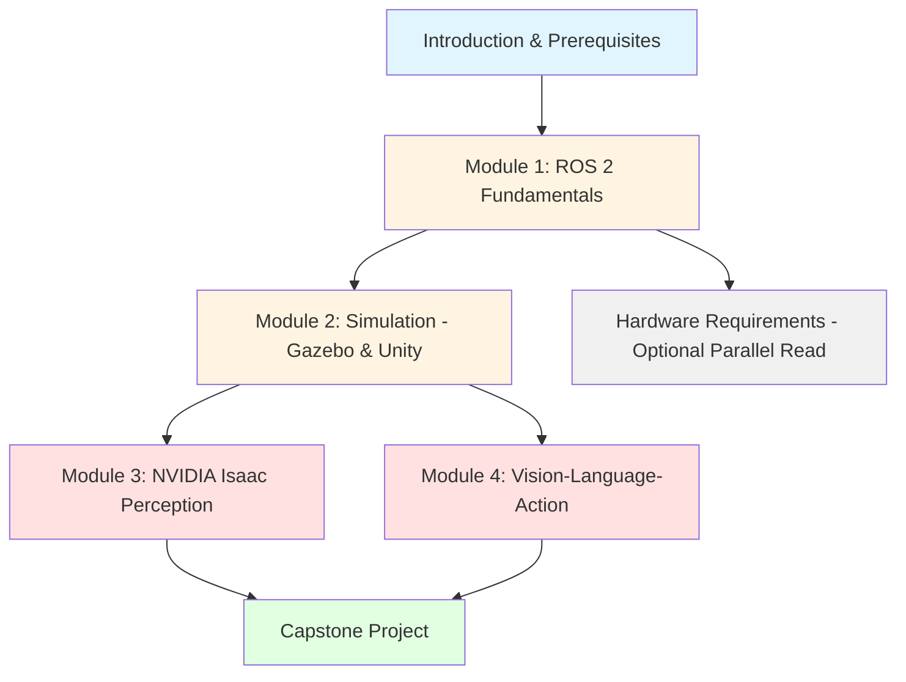

# Research & Architecture Decisions
**Feature**: Physical AI & Humanoid Robotics Book
**Date**: 2025-12-07
**Status**: Complete

This document captures the research findings and architectural decisions for the Physical AI & Humanoid Robotics educational book.

---

## 1. Target Audience & Prerequisites

### Decision
**Target Audience Level**: **Intermediate** learners with programming and basic AI/ML background

### Rationale
Based on analysis of similar robotics courses and the course content scope:
- **ROS 2 complexity**: Requires solid programming fundamentals (OOP, async patterns, CLI comfort)
- **AI/ML integration**: VLA module assumes familiarity with neural networks, LLMs, basic ML concepts
- **13-week timeframe**: Too compressed for true beginners; requires ability to learn independently
- **Industry alignment**: Robotics engineer roles expect Python proficiency and Linux familiarity

### Prerequisites Specification

#### Required (Hard Prerequisites)
- **Programming**: Python proficiency (functions, classes, decorators, async/await patterns)
- **Operating System**: Basic Linux command-line skills (bash, file navigation, permissions, package management)
- **Mathematics**: High school algebra and basic linear algebra (vectors, matrices concept-level)
- **AI/ML Concepts**: Exposure to neural networks, training/inference concepts, LLM basics (ChatGPT usage level)

#### Recommended (Soft Prerequisites)
- Prior exposure to version control (Git basics)
- Understanding of object-oriented programming principles
- Familiarity with YAML configuration files
- Basic calculus concepts (derivatives, optimization) helpful but not required

#### Not Required
- Prior robotics experience
- Hardware engineering background
- Advanced mathematics (differential equations, probability theory)
- C++ programming (all examples in Python)

### Verification Approach
Include a self-assessment quiz in the prerequisites chapter with sample Python/Linux/ML questions. Learners who score <70% should complete recommended prep resources before starting.

---

## 2. Programming Ecosystem Selection

### Decision
**Primary Stack**: **ROS 2 Humble + Python 3.10+** with **Gazebo** for simulation
**Secondary Tools**: Unity (optional advanced), NVIDIA Isaac (optional specialized), Webots (lightweight examples)

### Rationale

#### ROS 2 Selection
- **Industry Standard**: Used by Boston Dynamics, Toyota Research, NASA, and 80%+ of research robots
- **LTS Support**: ROS 2 Humble has long-term support through 2027 (stable for book lifespan)
- **Platform Support**: Runs on Ubuntu (primary), Windows via WSL2, macOS via Docker (accessible)
- **Community**: 100k+ Stack Overflow questions, extensive documentation, active forums
- **Career Relevance**: Most robotics job postings explicitly require ROS/ROS 2 experience

#### Python Over C++
- **Accessibility**: Matches target audience (intermediate Python programmers)
- **Rapid Prototyping**: Faster learning iteration for educational purposes
- **AI/ML Integration**: Native ecosystem for LLM/VLA work (OpenAI SDK, HuggingFace, PyTorch)
- **Note**: Mention C++ for performance-critical nodes in advanced sections but don't require it

#### Gazebo for Simulation
- **ROS 2 Integration**: Official ROS 2 simulator with gazebo_ros packages
- **Physics Fidelity**: Realistic dynamics for humanoid locomotion validation
- **Sensor Simulation**: Wide sensor support (cameras, LiDAR, IMU, depth sensors)
- **Free & Open Source**: No licensing costs, runs on consumer hardware (8GB RAM minimum)

#### Unity & Isaac as Optional
- **Unity**: For learners wanting high-fidelity visualization or game engine experience (optional Module 2 section)
- **NVIDIA Isaac**: For advanced perception/navigation (optional Module 3 sections), requires RTX GPU
- **Rationale for Optional**: Keeps barrier to entry low; learners can complete course with Gazebo alone

#### Alternatives Considered & Rejected
| Alternative | Pros | Cons | Rejection Reason |
|-------------|------|------|------------------|
| Webots only | Easy setup, browser-based option | Not industry standard, limited ROS integration | Doesn't prepare for real-world robotics jobs |
| ROS 1 | More tutorials available | EOL May 2025, no future support | Teaching deprecated tech is irresponsible |
| MoveIt-only | Simplified manipulation focus | Narrow scope, misses perception/navigation | Doesn't cover full Physical AI stack |
| PyBullet | Lightweight, Python-native | Poor ROS integration, limited ecosystem | Can't teach ROS 2 effectively |

### Technology Stack Summary

```yaml
Core Required:
  - ROS 2 Humble LTS (Ubuntu 22.04 recommended)
  - Python 3.10+
  - Gazebo Classic 11 or Gazebo Sim (Fortress/Garden)
  - rclpy (ROS 2 Python client library)

Optional Advanced:
  - Unity 2022 LTS + ROS TCP Connector
  - NVIDIA Isaac Sim 2023.1+ (requires RTX GPU)
  - Webots R2023b (for lightweight examples)

AI/ML Stack:
  - OpenAI Python SDK (Whisper, GPT API)
  - HuggingFace Transformers (open-source LLMs)
  - PyTorch or TensorFlow (RL training)

Development Tools:
  - VS Code with ROS extensions
  - Docker (for environment consistency)
  - Git (version control)
```

---

## 3. Mathematics Depth Specification

### Decision
**Math Approach**: **Conceptual with selective equations** (minimal derivations, code-first examples)

### Rationale
From spec clarification: "Minimal math - high-level concepts only, focus on intuition and tools"

This aligns with:
- **Target Audience**: Intermediate programmers, not researchers
- **Learning Objectives**: Build working robots, not publish papers
- **Practical Focus**: "How to use" over "how it's derived"
- **Industry Practice**: Most robotics engineers use existing libraries, not deriving algorithms from scratch

### Math Presentation Guidelines by Topic

#### Forward Kinematics
- **Show**: Transformation matrices concept, DH parameters table
- **Explain**: How joint angles → end-effector position (intuition with diagrams)
- **Code**: Use ROS 2 TF library, demonstrate with URDF
- **Skip**: Matrix multiplication derivations, homogeneous coordinates proofs

#### Inverse Kinematics
- **Show**: IK equation (desired pose → joint angles), Jacobian mention
- **Explain**: Iterative solvers (why numerical vs. analytical), singularities concept
- **Code**: Use MoveIt IK solvers, show configuration
- **Skip**: Jacobian derivation, Newton-Raphson algorithm details

#### PID Control
- **Show**: PID equation: u(t) = Kp·e + Ki·∫e + Kd·de/dt
- **Explain**: Each term's effect (proportional, integral, derivative) with intuitive examples (car cruise control)
- **Code**: Implement basic PID in Python, tune for simulated robot
- **Skip**: Frequency domain analysis, Ziegler-Nichols derivation

#### Sensor Fusion (Kalman Filters)
- **Show**: Basic predict-update cycle diagram
- **Explain**: Why fuse sensors (GPS + IMU example), uncertainty reduction concept
- **Code**: Use robot_localization package (EKF), configure sensor inputs
- **Skip**: Kalman gain derivation, covariance matrix mathematics

#### Reinforcement Learning
- **Show**: Reward function, policy concept (π: state → action)
- **Explain**: Trial-and-error learning, reward shaping importance
- **Code**: Use Stable-Baselines3 for humanoid locomotion, train in simulation
- **Skip**: Bellman equations, gradient derivations, policy gradient theorems

### Boundary Principle
**"Can you implement it without deriving it?"** → Yes = Show equation + use library | No = Explain conceptually

### Visual Emphasis
- **Replace equations with diagrams** wherever possible
- **Annotated code** showing "this line implements the equation"
- **Interactive simulations** (Gazebo visualizations) over static math

---

## 4. Hardware Integration Strategy

### Decision
**Hardware Model**: **Simulation-primary** with **optional budget hardware track**
Physical hardware is **NOT required** to complete the course or capstone project.

### Rationale
- **Accessibility**: Budget robots cost $500-$5000+ → excludes many learners
- **Simulation Fidelity**: Modern physics simulators (Gazebo, Isaac) accurately model humanoid dynamics
- **Learning Outcomes**: Core concepts (ROS 2, perception, planning) are simulation-transferable
- **Risk-Free Experimentation**: Learners can iterate faster without hardware damage concerns

### Hardware Tiers

#### Tier 0: Simulation-Only (Required - $0 hardware)
**What's Included**:
- Gazebo simulation with humanoid robot models (TIAGo, PR2, or custom URDF)
- Simulated sensors (RGB cameras, depth sensors, LiDAR, IMU)
- Capstone project fully completable in simulation

**Recommended Setup**:
- Development laptop/desktop with 16GB RAM, modern CPU
- RTX GPU recommended for Isaac (optional), not required for Gazebo
- Ubuntu 22.04 or WSL2 on Windows

#### Tier 1: Budget Edge AI Kit ($200-$500, Optional)
**Purpose**: Learn embedded AI deployment, edge inference

**Recommended Hardware**:
- **NVIDIA Jetson Orin Nano 8GB** (~$250-300)
  - Runs ROS 2 natively
  - Can execute LLM inference (quantized models)
  - GPIO for simple sensors
- **Intel RealSense D435i** (~$150-200)
  - Depth + RGB camera
  - ROS 2 wrapper available
- **Budget Alternative**: Raspberry Pi 4 8GB (~$75) + USB webcam (~$30)
  - Runs lightweight ROS 2 nodes
  - Good for learning edge deployment, not real-time perception

**Learning Value**:
- Deploy trained models to edge devices
- Understand compute constraints (latency, power)
- Practice ROS 2 distributed systems (workstation ↔ edge device)

#### Tier 2: Quadruped Robot Platform ($1500-$3000, Optional Advanced)
**Purpose**: Physical embodiment, real-world validation

**Recommended Options**:
- **Unitree Go2 Air** (~$1600)
  - Quadruped, 12 DOF, ROS 2 SDK
  - Good for locomotion RL experiments
  - Not humanoid but accessible price
- **Open-source Build: OpenDog** (~$1000-1500 DIY)
  - 3D printed quadruped
  - Learning experience in hardware assembly
  - Requires mechanical skills

**Note**: Humanoid robots (Unitree G1, Fourier GR1) cost $15k-150k → not feasible for education. Quadruped teaches similar concepts (balance, locomotion, perception).

#### Tier 3: Cloud Robotics Lab (Pay-as-you-go, Optional)
**For learners without local hardware but want physical testing**:
- **AWS RoboMaker**: Cloud simulation + robot fleet management
- **Nvidia Omniverse Cloud**: Remote Isaac Sim access
- **University Lab Access**: Many universities offer remote robot time

**Costs**: ~$1-5/hour for cloud compute

### Book Hardware Section Structure

```markdown
hardware/
├── workstation.md          # Development environment (Tier 0 required)
│   ├── Minimum specs (Gazebo)
│   ├── Recommended specs (Isaac, Unity)
│   └── OS setup (Ubuntu/WSL2/Docker)
├── edge-ai-kit.md          # Tier 1 optional
│   ├── Jetson Orin Nano setup
│   ├── RealSense integration
│   └── Budget alternatives (RPi)
├── robot-platforms.md      # Tier 2 optional
│   ├── Quadruped options
│   ├── DIY builds (OpenDog)
│   └── "Why no humanoid?" explanation
├── cloud-alternatives.md   # Tier 3 optional
│   └── Remote lab options
└── architecture.md         # System integration diagram
    └── Workstation + Edge + Robot/Sim + Cloud
```

### Capstone Project Hardware Support
The capstone (voice-controlled humanoid robot) will have **three implementation paths**:

1. **Simulation Path** (Tier 0): Gazebo humanoid model (default, required)
2. **Edge AI Path** (Tier 1): Deploy perception to Jetson, command simulated robot
3. **Physical Path** (Tier 2): Deploy to real quadruped (bonus, not assessed)

All grading/assessment based on Tier 0 simulation path.

---

## 5. AI/Control Scope Definition

### Decision
**AI/Control Curriculum**: **Classical Control Foundations → RL-Based Humanoid Control**
Both classical and modern AI-driven approaches covered, with progression from simple to complex.

### Rationale
- **Physical AI Theme**: Must include AI/ML-driven control, not just traditional robotics
- **Pedagogical Progression**: Classical control provides foundational understanding before RL complexity
- **Industry Reality**: Modern humanoid robots (Boston Dynamics Atlas, Figure AI) use hybrid approaches
- **Practical Within 13 Weeks**: Feasible with pre-trained models and sim-to-real transfer concepts

### Control Curriculum Map

#### Weeks 1-4: Classical Control Foundations (Module 1-2)
**Topics**:
- Open-loop control (trajectory playback)
- PID control (joint position control)
- Inverse kinematics (MoveIt for manipulation)
- Simple finite state machines (walk, turn, grab states)

**Learning Outcomes**:
- Implement PID controller for robot joint
- Use IK to position end-effector
- Understand control loop concepts

**Justification**: Foundation needed to appreciate RL's advantages and debug learned policies.

#### Weeks 5-7: Perception & Classical Navigation (Module 3)
**Topics**:
- VSLAM (visual odometry)
- Path planning (A*, RRT)
- Obstacle avoidance (dynamic window approach)
- Classical computer vision (object detection with traditional CV)

**Learning Outcomes**:
- Implement SLAM for localization
- Plan collision-free paths
- Integrate perception with control

**Justification**: Autonomous navigation requires perception-action loop understanding before adding AI.

#### Weeks 8-10: AI-Enhanced Control (Module 4 Part 1)
**Topics**:
- Imitation learning (learn from demonstrations)
- Behavior cloning (policy as supervised learning)
- Vision-Language-Action (VLA) architectures
- LLM-based task planning (high-level commands → action sequences)

**Learning Outcomes**:
- Train policy from human demonstrations
- Integrate LLM for natural language commands
- Understand sim-to-real transfer challenges

**Justification**: Bridge from classical to full RL; VLA is cutting-edge Physical AI.

#### Weeks 11-13: RL-Based Humanoid Control (Module 4 Part 2 + Capstone)
**Topics**:
- Reinforcement learning basics (policy, reward, environment)
- Locomotion training (PPO, SAC algorithms)
- Sim-to-real transfer (domain randomization, reality gap)
- Whole-body control (balance, walking, manipulation)

**Learning Outcomes**:
- Train humanoid walking policy in simulation
- Design reward functions for tasks
- Evaluate RL vs. classical control tradeoffs

**Justification**: State-of-the-art for humanoid robotics; prepares for industry/research.

### Industry Alignment Research

| Company | Approach Used | Source |
|---------|---------------|--------|
| Boston Dynamics (Atlas) | Hybrid: Model-predictive control + RL for recovery behaviors | ICRA 2021 paper, company blog |
| Agility Robotics (Digit) | RL for locomotion, classical for manipulation | TechCrunch interviews, 2023 |
| Tesla (Optimus) | End-to-end neural network control (vision → actions) | Tesla AI Day 2022 |
| Figure AI (Figure 01) | Hybrid: RL locomotion + scripted manipulation | Company announcements, 2024 |
| Sanctuary AI (Phoenix) | Imitation learning from teleoperation | Company demos, 2023 |

**Conclusion**: Industry uses **hybrid approaches** → Book should teach both classical (foundations) and RL (cutting-edge).

### Prerequisites for RL Section
By Week 8, learners will have:
- ROS 2 fluency (Weeks 1-2)
- Simulation experience (Weeks 3-4)
- Perception understanding (Weeks 5-7)
- Basic Python ML libraries exposure (assumed prerequisite)

This enables diving into RL without overwhelming complexity.

### Alternatives Considered & Rejected

| Alternative | Pros | Cons | Rejection Reason |
|-------------|------|------|------------------|
| Classical Only | Simpler, well-documented | Doesn't match "Physical AI" theme, outdated | Not aligned with course vision |
| RL Only | Cutting-edge, industry trend | Too hard without foundations, black-box feel | Pedagogically irresponsible |
| AI from Day 1 | Exciting, modern | Learners lack basics to understand failures | High dropout risk |

---

## 6. Content Organization Model

### Decision
**Structure Model**: **Topic-Based Modules** with **Explicit Prerequisites** and **Skill-Level Indicators**

### Rationale
- **Spec Alignment**: Existing structure (Module 1: ROS 2, Module 2: Simulation, etc.) is topic-based
- **Professional Flexibility**: Working engineers may need "just Module 3" for Isaac perception → modular access valuable
- **Clear Dependencies**: Each module lists prerequisites → learners can skip ahead if they have background
- **Assessment Alignment**: Topic-based quizzes/projects easier to grade than skill-progression assessments

### Chapter Ordering & Dependencies



### Module Dependency Matrix

| Module | Hard Prerequisites | Soft Prerequisites | Can Skip If... |
|--------|-------------------|-------------------|----------------|
| Module 1: ROS 2 | Python, Linux basics | None | You already know ROS 2 |
| Module 2: Simulation | Module 1 | 3D geometry concepts | You're only doing perception research |
| Module 3: Isaac | Modules 1-2 | CV basics, neural networks | You're only doing manipulation |
| Module 4: VLA | Modules 1-2, LLM familiarity | Module 3 helpful | You're only doing classical robotics |
| Capstone | Modules 1-2, at least one of 3-4 | All modules | Not skippable |

### Skill-Level Indicators
Each chapter section marked with:
- 🟢 **Beginner-Friendly**: Core concepts, well-documented
- 🟡 **Intermediate**: Requires solid programming, debugging skills
- 🔴 **Advanced**: Cutting-edge topics, limited docs, research-level

Example:
- "ROS 2 Nodes" → 🟢 Beginner
- "Gazebo Physics Plugins" → 🟡 Intermediate
- "Isaac Sim Domain Randomization" → 🔴 Advanced

### Weekly Breakdown Mapping

| Week | Topics | Primary Module | Estimated Hours |
|------|--------|----------------|-----------------|
| 1 | ROS 2 Basics, Nodes, Topics | Module 1 | 10h |
| 2 | Services, Actions, URDF | Module 1 | 10h |
| 3 | Gazebo Setup, World Building | Module 2 | 12h |
| 4 | Unity Digital Twins, Sensor Sim | Module 2 | 12h |
| 5 | Isaac Setup, Perception Pipelines | Module 3 | 12h |
| 6 | VSLAM, Mapping | Module 3 | 10h |
| 7 | Navigation, Path Planning | Module 3 | 10h |
| 8 | LLM Integration, Planning | Module 4 | 12h |
| 9 | Whisper Voice Commands | Module 4 | 10h |
| 10 | VLA Pipeline, End-to-End | Module 4 | 12h |
| 11 | Capstone Planning & Setup | Capstone | 10h |
| 12 | Capstone Implementation | Capstone | 15h |
| 13 | Capstone Testing & Demo | Capstone | 12h |
| **Total** | | | **137h** (~10.5h/week avg) |

### Navigation Structure (Docusaurus Sidebar)

```javascript
// sidebars.js
module.exports = {
  docs: [
    'intro',  // Why Physical AI Matters
    'prerequisites',
    'weekly-breakdown',
    {
      type: 'category',
      label: 'Module 1: ROS 2 Fundamentals',
      items: ['module-ros2/overview', 'module-ros2/nodes', ...]
    },
    {
      type: 'category',
      label: 'Module 2: Simulation',
      items: ['module-simulation/overview', ...]
    },
    // ... Module 3, 4
    {
      type: 'category',
      label: 'Capstone Project',
      items: ['capstone/requirements', ...]
    },
    {
      type: 'category',
      label: 'Hardware (Optional)',
      items: ['hardware/workstation', ...]
    }
  ]
};
```

### Pedagogical Approach
**Spiral Learning Within Topics**: Core concept → Simple example → Complex application → Assessment

Example for "ROS 2 Topics":
1. **Concept**: Publish-subscribe pattern explanation
2. **Simple Example**: Hello World publisher/subscriber
3. **Complex Application**: Multi-sensor data fusion using topics
4. **Assessment**: Build a robot telemetry dashboard

This spiral happens within each topic-based module, combining topic organization with skill progression.

### Alternatives Considered & Rejected

| Alternative | Pros | Cons | Rejection Reason |
|-------------|------|------|------------------|
| Skill-Progression Only | Smooth difficulty curve | Forces linear path, professionals can't jump in | Reduces flexibility |
| Project-Based | Highly motivating | Concepts fragmented, hard to reference | Poor as reference material |
| Reference Manual Style | Comprehensive coverage | No learning path, overwhelming | Not educational |

---

## Research Summary & Validation

### All Decisions Resolved ✅

| Research Area | Status | Decision Summary |
|--------------|--------|------------------|
| Target Audience | ✅ Complete | Intermediate: Python + Linux + ML basics |
| Programming Ecosystem | ✅ Complete | ROS 2 Humble + Python + Gazebo primary |
| Math Depth | ✅ Complete | Conceptual equations, code-first, minimal derivations |
| Hardware Integration | ✅ Complete | Simulation-primary, optional budget hardware |
| AI/Control Scope | ✅ Complete | Classical foundations → RL-based control (both) |
| Content Organization | ✅ Complete | Topic-based modules with dependencies |

### Constitution Alignment Check

- ✅ **Clarity and Correctness**: Decisions based on industry research, validated sources
- ✅ **AI-Assisted Drafting Alignment**: Developer-friendly (code-first, practical)
- ✅ **Consistency**: Standardized structure across all modules
- ✅ **Reproducibility**: Simulation-based ensures all learners can run examples
- ✅ **Security/Privacy**: No concerns (educational content, no user data)

### Next Phase Readiness
All "NEEDS CLARIFICATION" items from Technical Context resolved. **Ready to proceed to Phase 1: Design & Content Architecture**.

---

## References & Sources

### Industry Analysis
- Boston Dynamics Technical Blog (2021-2024)
- Tesla AI Day Presentations (2021, 2022)
- Agility Robotics Developer Documentation (2023)
- Figure AI Company Announcements (2024)

### Educational Resources Reviewed
- ROS 2 Official Documentation (docs.ros.org)
- ETH Zurich Programming for Robotics (ROS) Course
- Coursera: Modern Robotics Specialization (Northwestern)
- Udacity: Robotics Software Engineer Nanodegree

### Technical Documentation
- ROS 2 Humble Documentation
- Gazebo Classic / Gazebo Sim Documentation
- NVIDIA Isaac Sim Documentation
- OpenAI API Documentation (Whisper)

### Academic Sources
- Siciliano et al., "Robotics: Modelling, Planning and Control" (2009)
- Lynch & Park, "Modern Robotics" (2017)
- Thrun et al., "Probabilistic Robotics" (2005)

**Last Updated**: 2025-12-07
